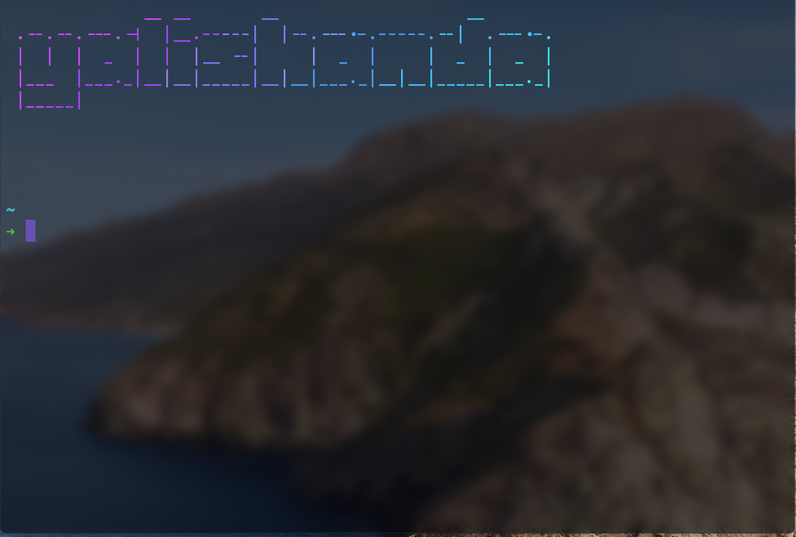
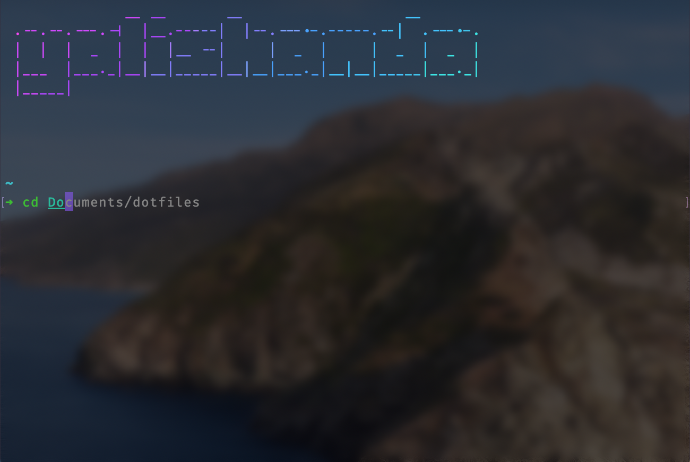
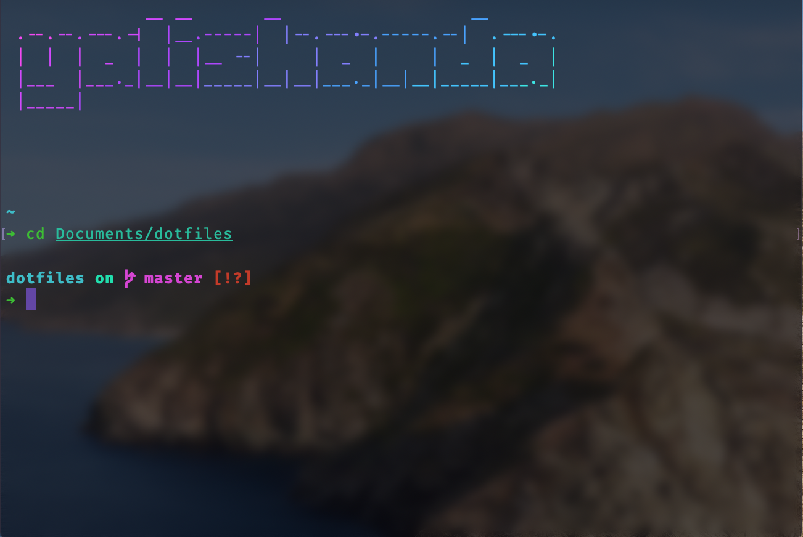
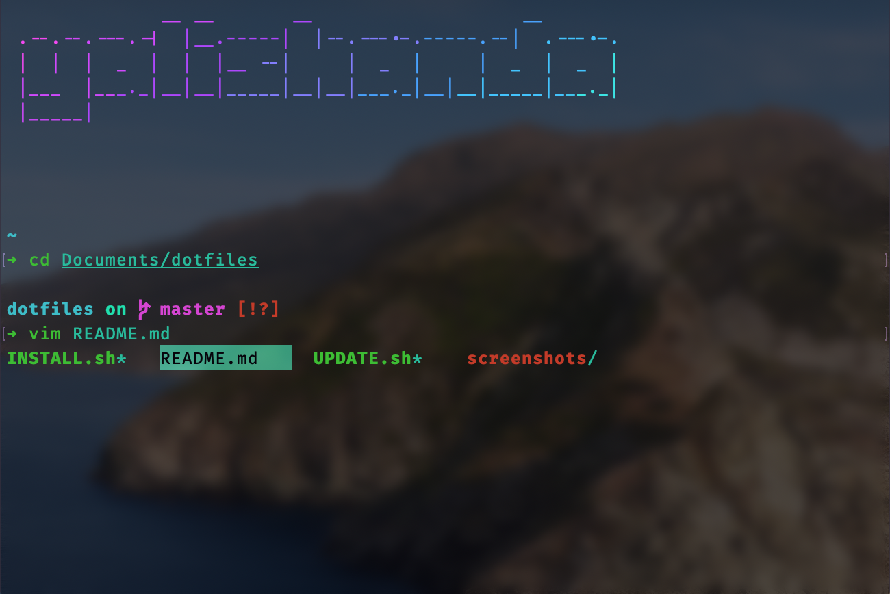
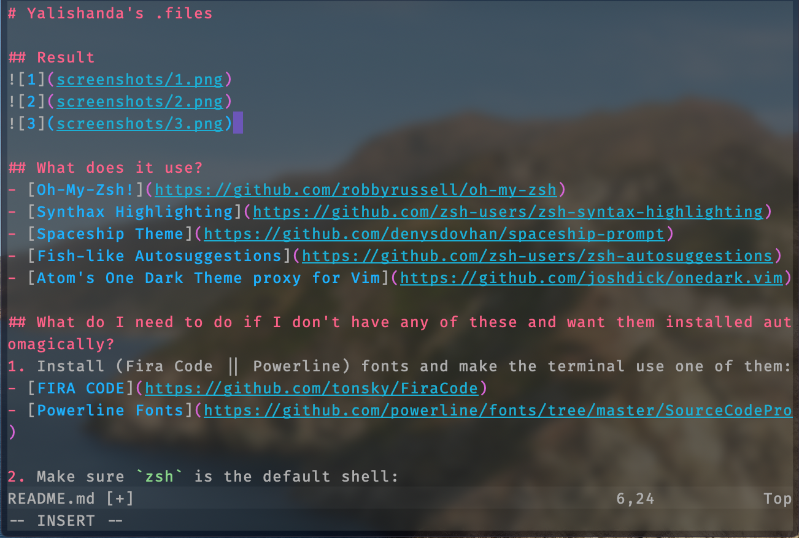
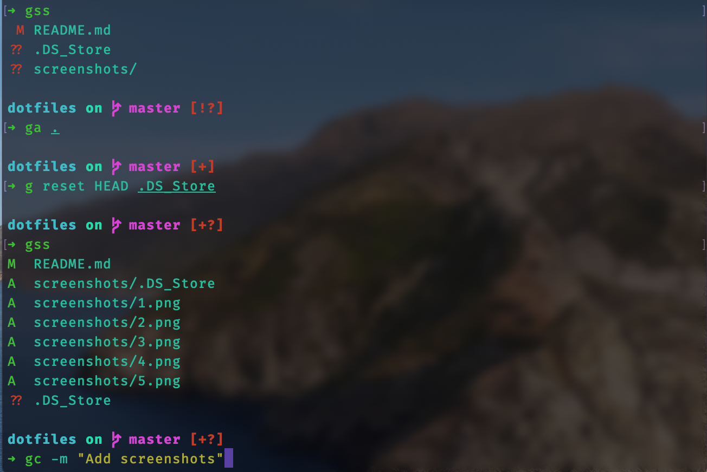

# Yalishanda's .files

## Result

## What does it use?
- [Oh-My-Zsh!](https://github.com/robbyrussell/oh-my-zsh)
- [Synthax Highlighting](https://github.com/zsh-users/zsh-syntax-highlighting)
- [Spaceship Theme](https://github.com/denysdovhan/spaceship-prompt)
- [Fish-like Autosuggestions](https://github.com/zsh-users/zsh-autosuggestions)
- [Atom's One Dark Theme proxy for Vim](https://github.com/joshdick/onedark.vim)

## What do I need to do if I don't have any of these and want them installed automagically?
1. Install (Fira Code || Powerline) fonts and make the terminal use one of them:
- [FIRA CODE](https://github.com/tonsky/FiraCode)
- [Powerline Fonts](https://github.com/powerline/fonts/tree/master/SourceCodePro)

2. Make sure `zsh` is the default shell:
- For normal user: `chsh -s /bin/zsh`
- For root: `sudo chsh -s /bin/zsh`

3. Abra-cadabra!
- Run the install script:
`./INSTALL.sh` (**WARNING**: This overwrites your `~/.zshrc` content and assumes you haven't installed *Oh-My-Zsh!* yet. If you have, please remove the folder.)
- Then, at any time, if there is an update available, easily update with:
`./UPDATE.sh`

## My color preferences
- Foreground: #1ABC9C
- Background: #000000 69% alpha
- Cursor: #7F51E4 67% alpha
- Bold Foreground: #1ADC9C
- Selection: #0900E9 65% alpha

## Collection of unnecessary but cool stuff
- [lolcat](https://github.com/busyloop/lolcat)
- [tldr](https://github.com/tldr-pages/tldr)
- [swiftenv](https://github.com/kylef/swiftenv)
- [xcenv](https://github.com/xcenv/xcenv)
- [cheat](https://github.com/cheat/cheat)
- [youtube-dl](https://github.com/ytdl-org/youtube-dl)
- [ytmdl](https://github.com/deepjyoti30/ytmdl)
- [yet-another-spotify-lyrics](https://github.com/goktug97/yet-another-spotify-lyrics)
- [SwagLyrics](https://github.com/SwagLyrics/SwagLyrics-For-Spotify)
- [glow (markdown reader)](https://github.com/charmbracelet/glow)
